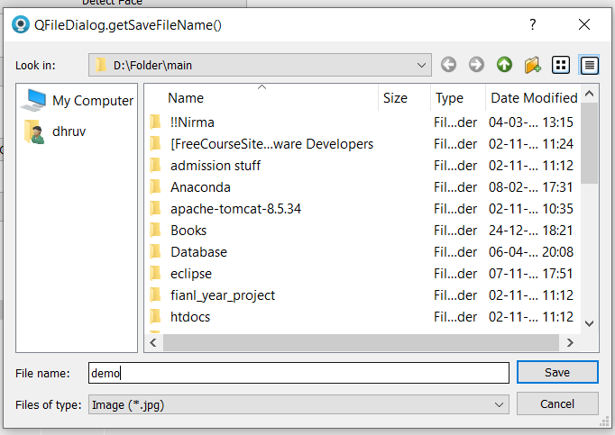

# User guide to the project

## This guide doesn’t contain any logic or Backend processes explaination, it’s about how to use the program.

Before we start getting into the project, lets discuss the project itself first.
The Facial detection program is to detect the human face and separate parts of the face using the webcam of the laptop or external.

It is possible that you may get the error related to path. Well, that’s because the path for some essential files are different on my pc then to on yours.

Check the line 284 (shape predictor) and line296 (haarcascade) and also provide new path for file at line42, 262.
I’ve attached these files so you may directly download that from my repository.

When you run the program, it starts with a blank screen but with only one button **“Start”**.

After clicking the **“Start”** button, all the controls and other buttons are represented. Also, the raw footage of the webcam is represented.

On the lest side, you will see 2 broad buttons such as **“Detect Face”** and **“Detect Separately”** respectively.

All the other buttons and scroll bar are visible but are not accessible other than **“End”**. Because they have no effect on pressing or changing (for the scrollbar) at anything at the current time.
But **“End”** stops the Webcam and exit to the Starting window.

Let’s talk about **“Detect Face”** first:
After pressing the **“Detect Face”** button, the raw Webcam footage will stop and you now will have the Webcam footage with a square surrounding the face of yours as **“Detecting”**, also the scrollbars would get enabled and the **“Capture”** button also gets enabled.
Also, when the window **“Detecting”** is ON, the button “Detecting Face” will be changed to **“STOP Facial Detection”** from where you can stop the facial detection.

You can use the scrollbar to change the color of the square box, and I do request to move the bar slowly as inaccurate values are being registered when moved quiet quickly.

Now we come to the **“Capture”**.
The **“Capture”** button will temporarily save the very recent frame from the Webcam and with the box with the same color, or we can say what you are seeing, to the memory and ask for location to save permanently with a name. if you would like to save the image select the details and you don’t need to add the extension as there is only one extension (.jpg) suitable for such file and is pre coded.

You may notice that the footage from window **“Detecting”** has stopped as the execution is moved from the frame processing to frame capture.

Now we get on with the **“Detect Separately”**:
The **“Detect Separately”** button will allow you to detect the parts of face which are Mouth, Eyes, Eyebrows, Jaw and Nose separately. 
When you will click the **“Detect Separately”** button, it will also be changed to **“STOP part detection”**. But also, the window **“Mapping”** will appear with enabling the buttons on the right.
You can use the buttons on the right to change the desired part detection also can use the Scrollbar to change the color of the dots.

The process for **“Capture”** is still the same, only that there will be 2 files stored (if **“Detecting” and “Mapping”** both the windows are running)

The step guide was up to here, now some quick points
You don’t have to follow the perfect same steps, you can also go from ‘Separate parts’ to ‘face’
and it will work just fine.
When none of the window (**“Detecting”** and **“Mapping”**) is active, the raw Webcam footage will be shown until **“End”** or any of the left button are being pressed.

The log file if being maintained for the activities.
